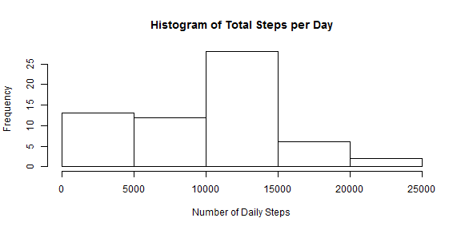
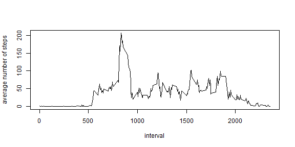
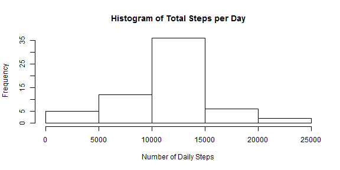
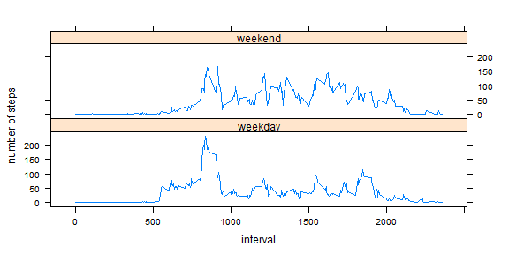

## Loading and preprocessing the data

```r
library(lattice) 
#read in the data
activity_data <- read.csv("activity.csv")
```

## What is mean total number of steps taken per day?

```r
daily_steps <-tapply(activity_data$steps, activity_data$date, FUN=sum, na.rm = TRUE)
hist(daily_steps, xlab = "Number of Daily Steps", main = "Histogram of Total Steps per Day")
```

 

```r
mean_daily_steps <-  mean(daily_steps, na.rm = TRUE)
median_daily_steps <-  median(daily_steps, na.rm = TRUE)
```
### Mean number of daily steps (not considering NAs):

```r
mean_daily_steps
```

```
## [1] 9354.23
```
### Median number of daily steps (not considering NAs):

```r
median_daily_steps
```

```
## [1] 10395
```

## What is the average daily activity pattern?

```r
mean_interval_steps <-tapply(activity_data$steps, activity_data$interval, FUN=mean,na.rm = TRUE)
plot(names(mean_interval_steps), mean_interval_steps, type = "l", xlab = "interval", ylab = "average number of steps")
```

 

```r
max_interval <- which.max(mean_interval_steps)
interval <- names(mean_interval_steps)[which.max(mean_interval_steps)]
```
### Interval with the highest number of steps on average:

```r
interval
```

```
## [1] "835"
```

## Imputing missing values

```r
rows_with_NA <- sum(is.na(activity_data$steps))

#make a copy of the data set and fill in the NA values with the mean of that interval
activity_data_interpolated <- activity_data
for (i in 1:length(activity_data_interpolated$steps)){
  if(is.na(activity_data_interpolated$steps[i])){
    activity_data_interpolated$steps[i] <- mean_interval_steps[as.character(activity_data_interpolated$interval[i])]
  }
}

daily_steps_interpolated <-tapply(activity_data_interpolated$steps, activity_data_interpolated$date, FUN=sum)
hist(daily_steps_interpolated, xlab = "Number of Daily Steps", main = "Histogram of Total Steps per Day")
```

 

```r
mean_daily_steps_interpolated <-  mean(daily_steps_interpolated, na.rm = TRUE)
median_daily_steps_interpolated <-  median(daily_steps_interpolated, na.rm = TRUE)
```
### Mean number of daily steps (Imputing NAs):

```r
mean_daily_steps_interpolated
```

```
## [1] 10766.19
```
### Median number of daily steps (Imputing NAs):

```r
median_daily_steps_interpolated
```

```
## [1] 10766.19
```
#### These estimates are significantly different than the estimates in the earlier part of the assignment. In the initial part, ignoring NAs had the effect of considering them as zeros (because they were ignored in a sum function). This meant that we significantly underestimated the step count initially. Imputing the data by replacing NAs with the mean for that interval means that are new step counts are higher.

## Are there differences in activity patterns between weekdays and weekends?

```r
#create factor variable for weekend and weekdays
for (i in 1:length(activity_data_interpolated$date)){
  if(weekdays(as.Date(activity_data_interpolated$date[i])) == "Saturday" ||weekdays(as.Date(activity_data_interpolated$date[i])) == "Sunday"){
    activity_data_interpolated$weekday[i] <- 0
    activity_data_interpolated$weekend[i] <- 1    
  }
  else{
    activity_data_interpolated$weekday[i] <- 1
    activity_data_interpolated$weekend[i] <- 0  
  }
}

activity_data_interpolated$weekday <- factor(activity_data_interpolated$weekday)
activity_data_interpolated$weekend <- factor(activity_data_interpolated$weekend)

#transform into a format that makes it easier to plot using lattice
weekend_interpolated_data <- subset (activity_data_interpolated,weekend == 1)
weekday_interpolated_data <- subset (activity_data_interpolated,weekday == 1)
mean_interval_steps_weekend_interpolated <-tapply(weekend_interpolated_data$steps, weekend_interpolated_data$interval, FUN=mean,na.rm = TRUE)
mean_interval_steps_weekday_interpolated <-tapply(weekday_interpolated_data$steps, weekday_interpolated_data$interval, FUN=mean,na.rm = TRUE)

mean_interval_weekend <- data.frame(as.numeric(names(mean_interval_steps_weekend_interpolated)),mean_interval_steps_weekend_interpolated,1)
mean_interval_weekday <- data.frame(as.numeric(names(mean_interval_steps_weekday_interpolated)),mean_interval_steps_weekday_interpolated,0)
names(mean_interval_weekend) <- c("interval","mean_steps", "weekend")
names(mean_interval_weekday) <- c("interval","mean_steps", "weekend")
mean_interval<-rbind(mean_interval_weekend,mean_interval_weekday)

weekend.f<-factor(mean_interval$weekend,levels=c(0,1),labels=c("weekday","weekend")) 
xyplot(mean_steps~interval|weekend.f,mean_interval,type = "l",layout=c(1,2), ylab= "number of steps")
```

 
